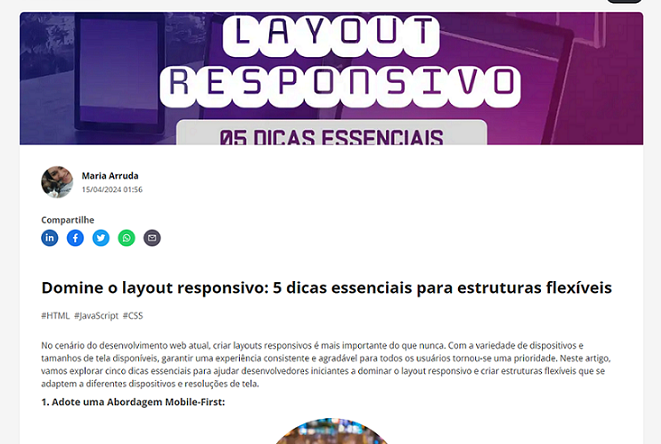

# Projeto artigo técnico gerado por I.A.s

 > Este é o repositório desenvolvido durante o bootcamp ChatGPT for devs na plataforma da [DIO](https://dio.me).

-------

Projeto com o objetivo de gerar um artigo técnico com um layout rico, leitura agradável e com foco em promover autoridade técnica.

<a href="https://dio.me/articles/domine-o-layout-responsivo-5-dicas-essenciais-para-estruturas-flexiveis" title="View PDF now"> 📕Clique aqui para ler o artigo</a>

## 💻 Tecnologias utilizadas no projeto

- [ChatGPT](https://chat.openai.com/) - para título e conteúdo
- [Lexica.art](https://lexica.art/) - para gerar imagens
- [Figma](https://www.figma.com/login?is_not_gen_0=true) - Para formatação de banners e Layouts

## 📄 Prompts e ferramentas

ChatGPT：

|   Ação   | prompt                                                                                                                                                                                                                                                                         |
| :------: | ------------------------------------------------------------------------------------------------------------------------------------------------------------------------------------------------------------------------------------------------------------------------------ |
|  título  | Crie 10 headlines para nomes de artigos sobre o layout responsivo                                                                                                                                                                            |
| conteúdo | Com base no título: "Dominando o layout responsivo: 5 Dicas Essenciais para Estruturas Flexíveis" se comporte como um escritor profissional de artigos especialista em contéudo para desenvolvimento web e gere um artigo conforme o título enfatizando dicas valiosas para desenvolvedores iniciantes.  [gere um call action para meu linkdin]  
|

Lexica.art：

 No léxica utilizamos o acervo público de imagens geradas por outras pessoas, os termos de pesquisa que utilizei durante a gravação do conteúdo foram:

-  CSS language
-  Mobile
 

## Features

- Conteúdo gerado via ChatGPT
- Imagens do acervo público geradas via Lexica.art

-------

    
&nbsp&nbsp&nbsp Graça Santos 
    &nbsp&nbsp&nbsp
    <a href="https://github.com/Graca-OAWEB">
    GitHub</a>
    &nbsp;|&nbsp;
    <a href="https://www.linkedin.com/in/graca-santos/">LinkedIn</a>
&nbsp;|&nbsp;

  

